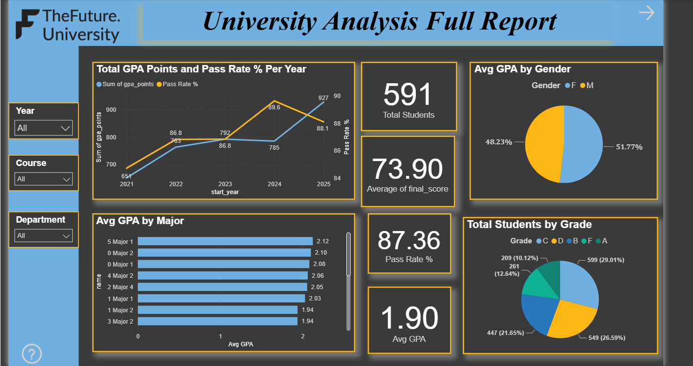
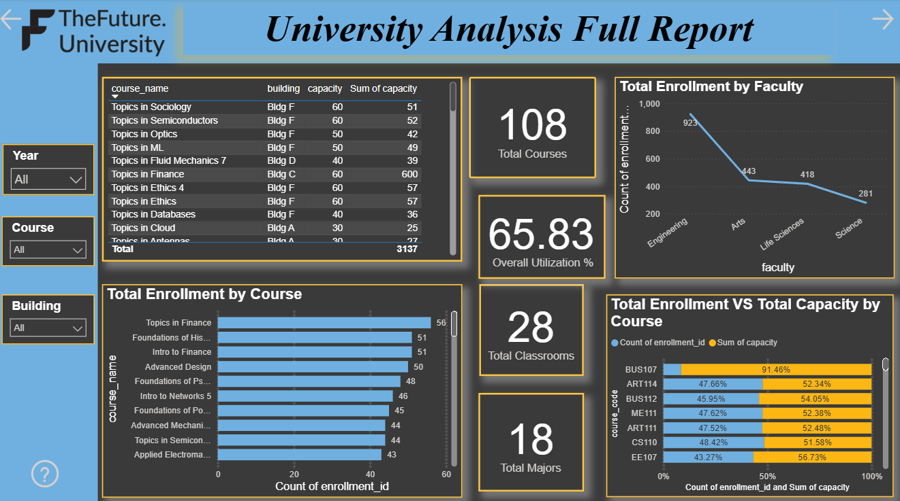
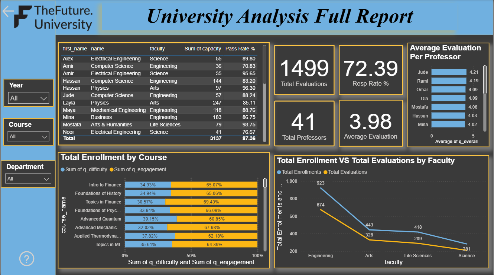

# University Database Analysis | SQL, Python & Power BI

## Project Overview

<p align="justify">
This project presents an end-to-end analysis of a normalized university database using <b>SQL Server</b>, <b>Python</b>, and <b>Power BI</b>. The objective was to answer academic and operational questions related to student performance, course capacity, teaching quality, prerequisites, scheduling, and institutional performance.
</p>

<p align="justify">
The project combines database querying, data validation, feature engineering, exploratory analysis, and interactive dashboard development to deliver actionable insights for academic decision-making.
</p>

---

## Business & Academic Context

Universities generate large amounts of structured data across students, departments, majors, courses, enrollments, classrooms, assessments, evaluations, and schedules. Without proper analysis, it becomes difficult to monitor academic performance, identify capacity issues, evaluate teaching quality, and detect data quality risks.

This project was designed to answer questions such as:

* Which majors have the highest academic performance?
* How are students distributed across grades and GPA levels?
* Are students enrolling in courses without completing prerequisites?
* Which courses or classrooms are under-utilized or over-utilized?
* How does teaching evaluation relate to student final scores?
* Are there scheduling conflicts between classrooms, professors, or students?
* What KPIs should academic management monitor regularly?

---

## Database Structure

The database consists of multiple interconnected academic entities, including:

* Departments
* Majors
* Professors
* Students
* Courses
* Prerequisites
* Classrooms
* Timeslots
* Course Offerings
* Offering Timeslots
* Enrollments
* Assessment Components
* Student Component Scores
* Evaluations
* Evaluation Summary

The database follows a normalized relational structure with one-to-many and many-to-many relationships.

---

## Tools & Technologies

* SQL Server
* Python
* Pandas
* Matplotlib
* Power BI
* DAX
* Excel / CSV datasets
* Data Modeling
* Data Validation
* Business Intelligence Reporting

---

## Analysis Workflow

The project followed a complete analytics workflow:

1. Understanding the database structure and relationships
2. Loading and querying data in SQL Server
3. Validating data quality and foreign key integrity
4. Performing Python-based data analysis
5. Recomputing academic metrics and validating results
6. Building Power BI dashboards
7. Summarizing insights and recommendations

---

## SQL Analysis

The SQL analysis focused on:

* Enrollment snapshots by major and start year
* Course offering capacity and utilization
* Prerequisite compliance checks
* Grade distribution and GPA analysis
* Top-performing students
* Teaching evaluation validation
* Scheduling conflict detection

---

## Python Analysis

The Python analysis included:

* Loading and inspecting database tables
* Enforcing data types
* Validating foreign key integrity
* Checking missing values and data quality issues
* Recomputing final scores and GPA-related metrics
* Creating student-level and offering-level analytical summaries
* Building visualizations for GPA, grades, response rates, and utilization

---

## Power BI Dashboard Pages

| Dashboard Page         | Purpose                                                                               |
| ---------------------- | ------------------------------------------------------------------------------------- |
| Student Success        | GPA trends, grade distribution, student performance, and cohort analysis              |
| Course & Capacity      | Course enrollment, classroom capacity, utilization, and resource planning             |
| Teaching Quality       | Evaluation scores, response rates, professor-level insights, and teaching performance |
| University Full Report | Executive-level overview of university performance KPIs                               |

---

## Dashboard Preview

### Student Success



### Course & Capacity



### Teaching Quality




---

## Key Findings

* Computer Science was identified as the top-performing major based on average GPA.
* Around 68% of students achieved grades between A and C, indicating generally strong academic performance.
* 203 students were found to have enrolled in courses without completing required prerequisites.
* Teaching evaluation scores showed a moderate positive relationship with student final scores.
* Capacity utilization analysis highlighted opportunities to rebalance course and classroom usage.
* Data quality checks identified missing or inconsistent values in some enrollment and assessment records.

---

## Recommendations

Based on the analysis, the following recommendations were proposed:

* Strengthen prerequisite enforcement during student course registration.
* Rebalance course capacities to reduce under-utilization and avoid classroom overload.
* Improve data governance by regularly validating assessments, evaluations, and enrollment records.
* Encourage higher teaching evaluation participation to improve feedback reliability.
* Use Power BI dashboards for ongoing monitoring of GPA trends, utilization rates, and teaching performance.

---

## Project Outcome

<p align="justify">
This project demonstrates the ability to work across the full data analytics workflow, from relational database understanding and SQL querying to Python analysis and Power BI dashboard development. It shows how academic institutions can use data analytics to monitor performance, improve planning, and support evidence-based decision-making.
</p>

The project highlights practical skills in:

* SQL database analysis
* Python data analysis
* Power BI dashboard development
* Academic performance analytics
* Data validation and reconciliation
* KPI reporting
* Education analytics

---

## Repository Structure

```text
university-database-analysis-sql-python-powerbi/
│
├── README.md
├── powerbi/
│   └── university-analysis-dashboard.pbix
│
├── docs/
│   ├── university-database-analysis-report.pdf
│   └── university-database-analysis-presentation.pptx
│
├── images/
│   ├── student-success.png
│   ├── course-capacity.png
│   ├── teaching-quality.png
│   └── university-full-report.png
│
└── notebooks/
    └── analysis.ipynb
```

---

## Author

**Yasir Awad**
Data Analyst | Business Intelligence | Energy & Operations Analytics

* LinkedIn: https://www.linkedin.com/in/yasirawad
* GitHub: https://github.com/Yasir101-hi
* Email: [yasir.petro.analytics@outlook.com](mailto:yasir.petro.analytics@outlook.com)

---

## Project Status

Completed. Future improvements may include adding more SQL scripts, publishing a cleaned notebook, and improving dashboard UI consistency.

