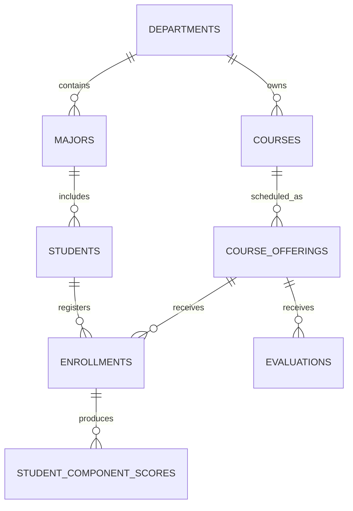

# University Database Analysis | SQL, Python & Power BI

An end-to-end education analytics project that uses a normalized university database to evaluate student success, prerequisite compliance, course capacity, teaching quality, scheduling, and institutional data quality.


## Executive Snapshot

| KPI | Verified result |
|---|---:|
| Student records | **600** |
| Students with at least one enrollment | **591** |
| Course-enrollment records | **2,065** |
| Average final score | **73.90 / 100** |
| Pass rate (A-D) | **87.36%** |
| A-C outcome rate | **60.77% of enrollments** |
| Prerequisite exceptions | **203 enrollments / 183 students** |
| Section-seat utilization | **65.83%** |
| Evaluation responses | **1,499** |
| Weighted evaluation response rate | **72.59%** |

> Student metrics use distinct `student_id`; grade outcomes use enrollment records. Keeping these grains separate prevents the denominator error found in the original dashboard labels.

## Academic and Operational Problem

University data is distributed across students, departments, majors, courses, enrollments, assessments, classrooms, schedules, and evaluations. Without a unified reporting layer, management cannot reliably answer:

- Which majors and cohorts perform best?
- Where are students registering without evidence of completing prerequisites?
- Which sections and faculties have unused capacity?
- How reliable are teaching evaluations and their response rates?
- Are academic metrics consistent across SQL, Python, and Power BI outputs?

## Solution

The project combines:

1. **SQL Server** for relational querying and academic-integrity checks.
2. **Python and Pandas** for validation, metric reconciliation, and exploratory analysis.
3. **Power BI and DAX** for interactive KPI monitoring.
4. **A normalized data model** connecting academic, operational, assessment, and evaluation entities.

## Corrected Dashboard Pages

### 1. Student Success

Separates distinct students from course-enrollment outcomes and defines the grade denominator explicitly.


### 2. Course Capacity & Utilization

Shows enrollment demand, section capacity, faculty utilization, and the highest-demand courses.


### 3. Teaching Quality & Participation

Reports evaluation scores together with response counts and response rates. Instructor comparisons require at least 20 responses.


## Verified Findings

### Student success

- The student roster contains **600 students**; **591** have at least one enrollment.
- The dataset contains **2,065 enrollment records**, with an average final score of **73.90**.
- **87.36%** of enrollment outcomes are passing grades A-D.
- **60.77%** of enrollment outcomes are grades A-C.
- The leading anonymized program, **Major 5-1**, recorded an average final score of **76.23** across **131 enrollment records**. The source does not provide a public mapping from anonymized labels to named programs.

### Prerequisite compliance

- The prerequisite screen produced **203 enrollment-level exceptions**, affecting **183 distinct students**.
- An exception means the data contains no passing A-D enrollment for at least one required prerequisite course.
- This is a screening result: term sequence, transferred credit, waivers, and equivalency records are not available and require registrar validation.

### Capacity

- The model contains **108 courses**, **61 delivered sections**, and **28 classrooms**.
- The 61 sections provide **3,137 seats** for **2,065 enrollment records**, producing **65.83% weighted section-seat utilization**.
- Utilization varies materially across faculties, supporting targeted section consolidation or expansion rather than a university-wide action.

### Teaching quality

- Students submitted **1,499 evaluations** with an average overall score of **3.98 / 5**.
- The weighted evaluation response rate is **72.59%**.
- The professor roster contains **41 records**, while **29 instructors** are assigned to the analyzed sections.
- Instructor results are displayed with response volume and a minimum sample of 20 responses.

## Management Recommendations

1. Review the 203 prerequisite exceptions with the registrar before taking action, focusing first on the 183 affected students.
2. Use section-level utilization thresholds to consolidate low-demand sections and protect capacity in high-demand courses.
3. Track student counts and enrollment outcomes as separate measures in Power BI.
4. Display evaluation score and response rate together; suppress or flag instructor rankings with weak response volume.
5. Maintain an approved mapping table if anonymized major labels must be translated into public program names.
6. Reconcile SQL, Python, and Power BI outputs before every reporting release.

## Data Model

See the documented [data model and analytical grains](docs/data-model.md).


```mermaid
erDiagram
    DEPARTMENTS ||--o{ MAJORS : contains
    MAJORS ||--o{ STUDENTS : includes
    DEPARTMENTS ||--o{ COURSES : owns
    COURSES ||--o{ COURSE_OFFERINGS : scheduled_as
    STUDENTS ||--o{ ENROLLMENTS : registers
    COURSE_OFFERINGS ||--o{ ENROLLMENTS : receives
    ENROLLMENTS ||--o{ STUDENT_COMPONENT_SCORES : produces
    COURSE_OFFERINGS ||--o{ EVALUATIONS : receives
```

## Reproducible Analysis

- [SQL analysis queries](sql/university-analysis-queries.sql)
- [Python analysis notebook](notebooks/university-analysis.ipynb)
- [KPI definitions and validation rules](docs/kpi-reference.md)
- [Power BI metric corrections](powerbi/README.md)

Create a Python environment with `pip install -r requirements.txt`, then configure
the SQL Server connection shown in the notebook. The public repository does not
include the source CSV extracts or credentials; outputs are intentionally cleared.

Notebook outputs remain cleared in the public repository to avoid publishing record-level academic data.

## Repository Structure

```text
university-database-analysis-sql-python-powerbi/
├── README.md
├── requirements.txt
├── sql/university-analysis-queries.sql
├── notebooks/university-analysis.ipynb
├── powerbi/
│   ├── university-analysis-dashboard.pbix
│   └── README.md
├── docs/
│   ├── university-database-analysis-report.pdf
│   ├── university-database-analysis-presentation.pptx
│   ├── data-model.md
│   └── kpi-reference.md
└── images/
    ├── student-success.png
    ├── course-capacity.png
    └── teaching-quality.png
```

## Validation Note

All figures above were recomputed from the supplied CSV tables. Missing `final_score` values are excluded from the average. Prerequisite findings remain screening-level until academic sequence, waivers, transferred credit, and equivalencies are available.

## Author

**Yasir Awad**  
Data Analyst | Business Intelligence | Energy & Operations Analytics

- [GitHub](https://github.com/Yasir101-hi)
- [LinkedIn](https://www.linkedin.com/in/yasirawad)
- Email: [yasir.petro.analytics@outlook.com](mailto:yasir.petro.analytics@outlook.com)

## Project Status

Completed and reconciled. Dashboard images and documentation use verified denominators and clearly separate student, enrollment, section, and evaluation grains.
