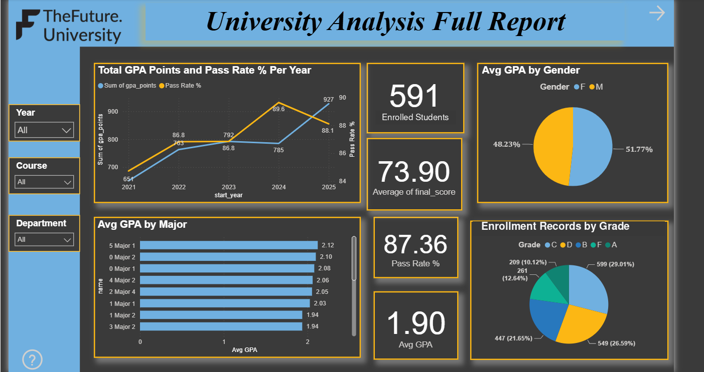
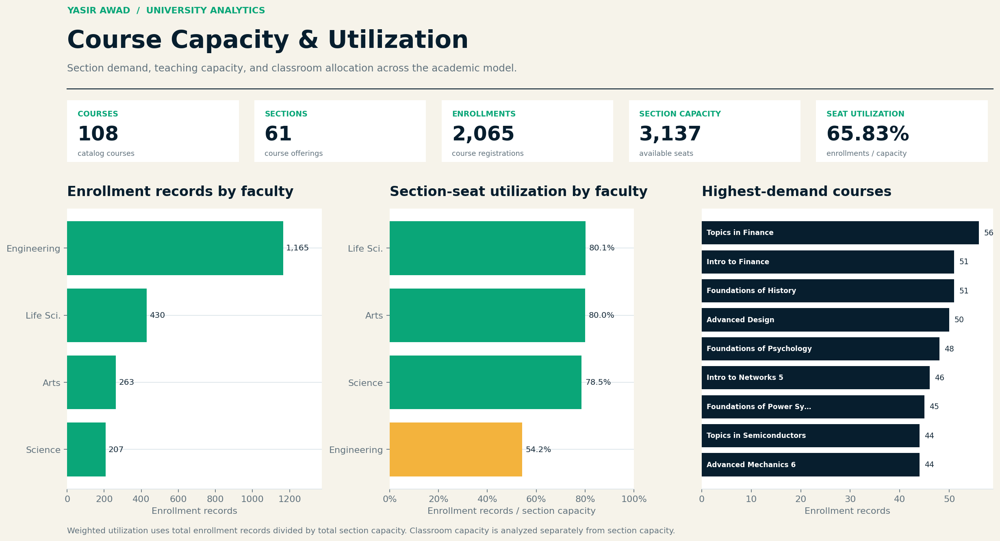
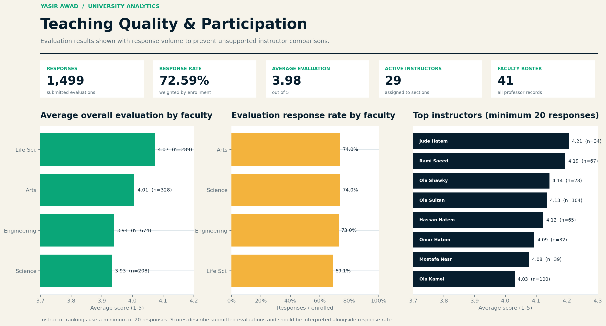
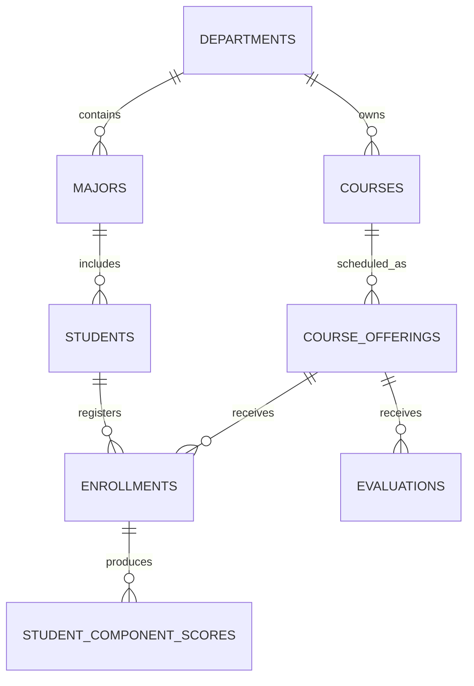

# University Database Analysis | SQL, Python & Power BI

An end-to-end education analytics project that uses a normalized university database to evaluate student success, prerequisite compliance, course capacity, teaching quality, scheduling, and institutional data quality.



## Executive Snapshot

| Finding | Result |
|---|---:|
| Top-performing major | **Computer Science** |
| Students receiving grades A–C | **≈68%** |
| Prerequisite-compliance exceptions | **203 students** |
| Dashboard pages | **3** |
| Core analytical areas | **Student success, capacity, teaching quality** |

> Figures above are based on the analysis outputs documented in this repository. The Power BI report and supporting report remain the authoritative project sources.

## Academic and Operational Problem

University data is distributed across students, departments, majors, courses, enrollments, assessments, classrooms, schedules, and evaluations. Without a unified reporting layer, management cannot easily answer:

- Which majors and cohorts perform best?
- Where are students registering without completing prerequisites?
- Which courses and classrooms are under- or over-utilized?
- How reliable are teaching evaluations and their response rates?
- Are academic metrics consistent across database, Python, and Power BI outputs?
- Where should academic management intervene first?

## Solution

I built an end-to-end analytical workflow combining:

1. **SQL Server** for relational querying and academic integrity checks.
2. **Python and Pandas** for validation, metric reconciliation, and exploratory analysis.
3. **Power BI and DAX** for interactive KPI monitoring and management reporting.
4. **A normalized data model** connecting academic, operational, and evaluation entities.

## Dashboard Pages

### 1. Student Success

Tracks GPA patterns, grade distribution, major and cohort performance, and student-level outcomes.


### 2. Course and Capacity

Evaluates course demand, enrollment, classroom capacity, and utilization to support resource planning.



### 3. Teaching Quality

Monitors evaluation scores, participation, professor-level patterns, and the relationship between evaluation results and student performance.



## Key Findings

### Student performance

- **Computer Science** recorded the highest average GPA among the analyzed majors.
- Approximately **68% of students received grades between A and C**, indicating broadly positive performance while leaving a material group requiring academic support.
- Student- and cohort-level analysis provides a basis for targeted advising rather than institution-wide interventions.

### Academic compliance and data quality

- **203 students** were identified as enrolled in courses without completing the required prerequisites.
- Validation checks found missing or inconsistent values in portions of the enrollment and assessment data.
- Recomputing scores in Python helped verify that reported academic metrics were consistent with the underlying records.

### Capacity and teaching quality

- Course and classroom utilization showed opportunities to rebalance resources between under-used and highly demanded offerings.
- Teaching evaluations showed a **moderate positive relationship** with final student scores.
- Evaluation response rates should be considered when interpreting professor-level teaching indicators.

## Management Recommendations

1. Add an automated prerequisite validation step to the registration workflow and review the 203 exceptions.
2. Use utilization thresholds to flag course sections that should be consolidated, expanded, or moved.
3. Introduce scheduled data-quality checks for enrollments, assessment components, and evaluation records.
4. Track evaluation response rate alongside teaching score to avoid drawing conclusions from weak participation.
5. Monitor GPA and grade distribution by major and cohort to identify targeted academic-support needs.
6. Reconcile SQL, Python, and Power BI outputs before each reporting cycle.

## Data Model

The project uses a normalized relational structure covering academic organization, people, courses, delivery, assessment, enrollment, and evaluation. See the [data model documentation](docs/data-model.md).


```mermaid
erDiagram
    DEPARTMENTS ||--o{ MAJORS : contains
    MAJORS ||--o{ STUDENTS : includes
    DEPARTMENTS ||--o{ COURSES : owns
    COURSES ||--o{ COURSE_OFFERINGS : scheduled_as
    STUDENTS ||--o{ ENROLLMENTS : registers
    COURSE_OFFERINGS ||--o{ ENROLLMENTS : receives
    ENROLLMENTS ||--o{ STUDENT_COMPONENT_SCORES : produces
    COURSE_OFFERINGS ||--o{ EVALUATIONS : receives
```

## KPI Reference

The [KPI reference](docs/kpi-reference.md) documents the business meaning and validation status of the core indicators used in the analysis.

## Analytical Workflow

1. Review database entities, keys, and relationships.
2. Query enrollment, performance, capacity, prerequisite, schedule, and evaluation data in SQL Server.
3. Validate data types, missing values, and foreign-key consistency in Python.
4. Recompute academic metrics and reconcile outputs.
5. Model the reporting layer in Power BI.
6. Build management-facing dashboards and recommendations.

## Tools and Skills Demonstrated

- SQL Server and relational querying
- Python, Pandas, and exploratory analysis
- Power BI, DAX, and data modeling
- Data validation and reconciliation
- Education and academic-performance analytics
- Capacity and utilization analysis
- KPI design and data storytelling

## Repository Structure

```text
university-database-analysis-sql-python-powerbi/
├── README.md
├── powerbi/
│   └── university-analysis-dashboard.pbix
├── docs/
│   ├── university-database-analysis-report.pdf
│   ├── university-database-analysis-presentation.pptx
│   ├── data-model.md
│   └── kpi-reference.md
└── images/
    ├── student-success.png
    ├── course-capacity.png
    └── teaching-quality.png
```

## How to Review the Project

1. Read the executive snapshot and key findings.
2. Review the three dashboard screenshots.
3. Open the PDF report for the complete management-facing analysis.
4. Open the PBIX file in Power BI Desktop for interactive filtering and model inspection.
5. Review the presentation for a concise stakeholder summary.

## Validation Note

Only values already supported by the project analysis are presented as exact findings. Capacity, evaluation, and correlation results are described qualitatively where the repository does not expose a verified numeric value.

## Author

**Yasir Awad**  
Data Analyst | Business Intelligence | Energy & Operations Analytics

- [GitHub](https://github.com/Yasir101-hi)
- [LinkedIn](https://www.linkedin.com/in/yasirawad)
- Email: [yasir.petro.analytics@outlook.com](mailto:yasir.petro.analytics@outlook.com)

## Project Status

Completed. Future improvements include publishing cleaned SQL scripts and a reproducible analysis notebook.
