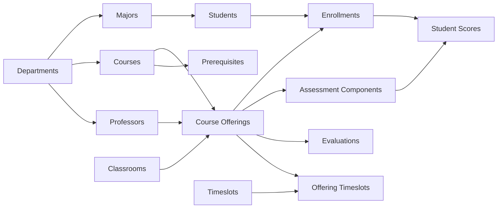

# University Data Model

## Overview

The project uses a normalized relational model that separates academic organization, people, curriculum, course delivery, enrollment, assessment, scheduling, and evaluation data.

| Entity | Analytical role |
|---|---|
| `Departments` | Organizes majors, professors, and courses |
| `Majors` | Groups students by academic program |
| `Professors` | Supports teaching and evaluation analysis |
| `Students` | Student-level profile and cohort analysis |
| `Courses` | Curriculum and prerequisite definition |
| `Prerequisites` | Required course dependencies |
| `Classrooms` | Physical capacity and utilization |
| `Timeslots` | Scheduling periods |
| `Course Offerings` | Delivered course sections by term |
| `Offering Timeslots` | Resolves offering-to-schedule assignments |
| `Enrollments` | Connects students to course offerings |
| `Assessment Components` | Defines graded work and weighting |
| `Student Component Scores` | Stores student assessment results |
| `Evaluations` | Student feedback and teaching-quality observations |
| `Evaluation Summary` | Aggregated evaluation indicators |

## Logical Relationship Map

## Analytical Grains

- **Student grain:** student profile, major, cohort, and academic outcome.
- **Enrollment grain:** one student registered in one course offering.
- **Assessment grain:** one component score for one enrolled student.
- **Offering grain:** one delivered course section in a term.
- **Evaluation grain:** one evaluation response or summarized teaching indicator.
- **Schedule grain:** one offering assigned to one or more timeslots and a classroom.

## Modeling Purpose

- Student and major relationships support GPA, grade, and cohort analysis.
- Course and prerequisite relationships support compliance testing.
- Offering, classroom, and timeslot relationships support utilization and conflict analysis.
- Assessment relationships support final-score reconciliation.
- Evaluation relationships support response-rate and teaching-quality analysis.

## Validation Guidance

The PBIX Model view and source database schema remain authoritative for exact key names, cardinality, active/inactive relationships, and filter direction. Before production use, validate:

1. Primary-key uniqueness.
2. Foreign-key integrity.
3. Enrollment-to-assessment completeness.
4. Prerequisite effective-term logic.
5. Duplicate schedule assignments.
6. Evaluation response denominators.
